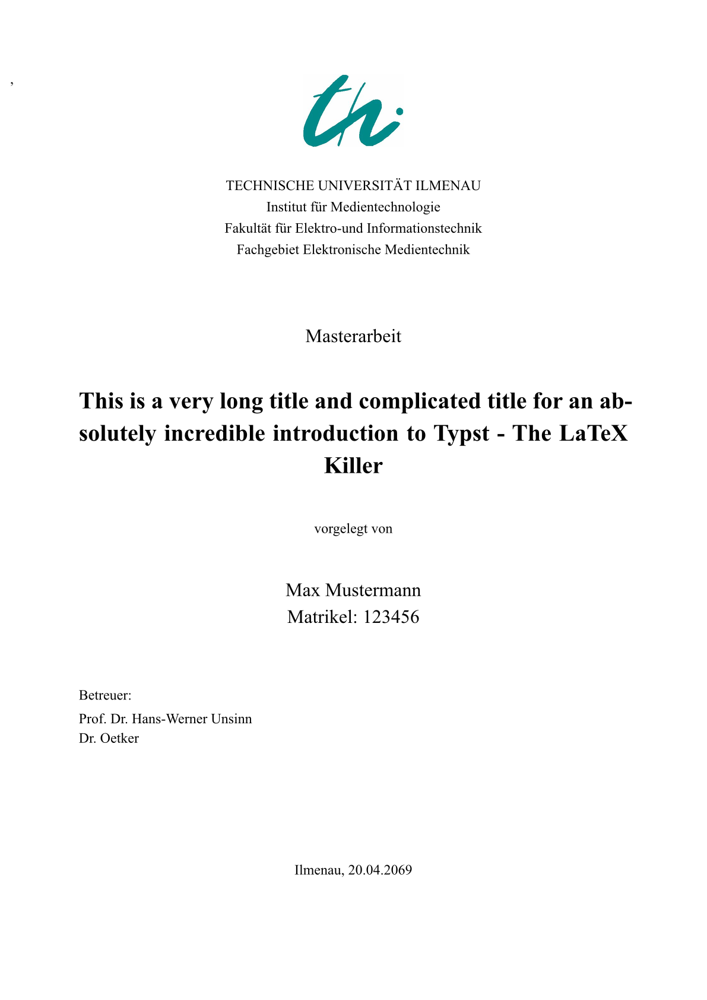
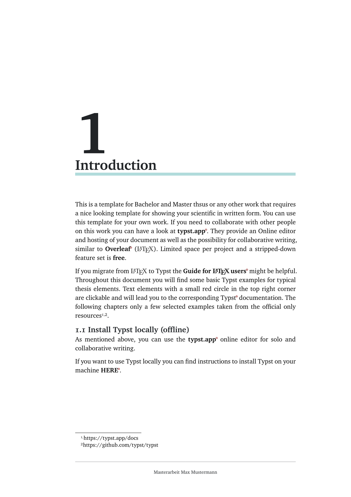

# TU Ilmenau Thesis Template (unofficial)

 

> [!Note] 
>This repository provides a Typst template for your Bachelor's/Master's Thesis (or other projects) at the TU Ilmenau. The template was created to be an alternative to Latex. Supported template languages are English and German. 
The template comes with to printing flavors: one-sided and double-sided, which accounts for proper margins considering document's binding.

> [!IMPORTANT] 
>**This is NOT an official template from TU Ilmenau.**
>Ask your supervisor if you can this template for your work. 
>For template specific question you can drop an issue here or contact me via
<a href="mailto:email-to:christian.schneiderwind@tu-ilmenau.de">mail</a>.

> [!TIP] 
> Never heard of Typst? 
>**Typst** is markup-based type-setting system and is a modern alternative to LaTeX. 
If you have not used Typst before, checkout there website
[official Typst website](https://typst.app/) for reference and documentation.

# Installation (locally)


1. Install Typst: 
>Instructions for installing Typst (Win, Linux, macOS, Nix, Docker) can be found at the official [repository](https://github.com/typst/typst).  
2. Download the latest template version (.zip) from the [release-page](https://github.com/Vibrrra/TUI_Thesis_Typst/releases) 

3. **IF NOT EXISTENT**: Create a folder called `local` inside the typst/packages/ path.
> - Windows: `AppData/Local/typst/packages/` 
> - Linux:  `$XDG_DATA_HOME` or `~/.local/share`
> - macOS: `~/Library/Application Support`

4. Extract archive folder with all its contents to the local folder. You should now have a folder structure like this:
> `../typst/packages/local/tui-thesis-typst/0.8.0/`

# USAGE
After you completeted the steps above, you can generate a new template from your terminal. 

Example:
``` typst
% initialize template at the current path
typst init @local/tui-thesis-typst:0.8.0
```

The thesis template is generated using the `thesis-function`
```typst 
// template.typ

...

#show: thesis.with(
    author: "Fin Mertens",
    title: "A Hero's thoughts on the Enchiridion",
    thesis-type: "Master thesis",
    language: "en",
    supervisor: (Prof. Dr ....

)

# Introduction
Bla bla bla ....


```

The generated `template.typ` is the entrypoint for document.
Some convience functions (e.g. flex-caption) need explicit import. 
You can import all template core functions with `#import @local/tui-thesis-typst:0.8.0: *` at the start of your file.
Use the example figures and tables as a starting point.


